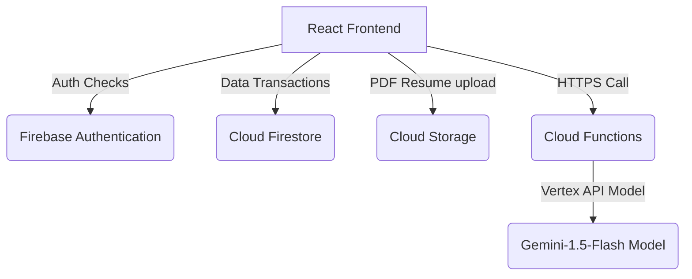

# Project Documentation 📚

## 1. Abstract
The College Placement Portal is a web application designed to centralize and automate the campus placement drive process. The portal handles role-based workflows for students, company representatives (HR), and Training & Placement Officers (TPOs). Key integrations include automatic academic eligibility verification and Vertex AI Gemini LLM-powered resume analytics.

---

## 2. Problem Statement
Placement cell coordination is highly disjointed:
1. Academic eligibility (CGPA, Branch, Year) is verified manually on spreadsheets, leading to errors.
2. Students often miss job application deadlines due to fragmented communications.
3. Corporate recruiters receive applications from ineligible candidates, cluttering their pipelines.
4. Students lack immediate guidelines on how to format or align their resumes with target Job Descriptions.

---

## 3. System Architecture
The application uses a Serverless Architecture:
*   **User Interface**: React 18 SPA built with TypeScript, Tailwind CSS, and Recharts.
*   **Authentication & Auth Store**: Firebase Auth (Email & Google Providers).
*   **Database**: Cloud Firestore (NoSQL Document Store).
*   **Storage Services**: Cloud Storage (PDF Resume upload constraints).
*   **AI Analytics**: Vertex AI Gemini API via Firebase Cloud Functions.

---

## 4. Module Descriptions

### Student Module
Students manage their profile data (CGPA, branch, projects, resume), search for eligible openings, view real-time status alerts, and access AI analysis of their resume against target JDs.

### Company HR Module
Recruiters post openings, declare eligibility filters, view applicant details (pre-filtered by eligibility rules), download PDF resumes, and schedule interviews.

### TPO Admin Module
TPO admins manage partner company and student databases, inspect campus placement charts, monitor package ranges, and export spreadsheet reports.

---

## 5. Security Rules
*   **Firestore**: Verified role-based write limits (only student self edits, TPO master edit).
*   **Storage**: Restricts uploads to PDF documents less than 5MB.
